# Design pattern app 
The Design Pattern App is a Java application that demonstrates the implementation of several design patterns. It showcases the usage of the following design patterns:
1. Chain of Responsibility
  - The Chain of Responsibility pattern allows an object to pass a request along a chain of potential handlers until one of them handles the request.
  - Each handler in the chain has the ability to handle the request or pass it to the next handler in the chain.
  - The pattern decouples the sender of the request from its receivers and provides flexibility in dynamically rearranging the chain or adding new handlers.
  - In the app, the Handler, AbstractHandler, HandlerA, and HandlerB classes represent the chain of responsibility. Each handler has a reference to the next handler and can delegate the request to it if needed. The client class creates the handler chain and initiates the handling of requests.

2. Command
  - The Command pattern encapsulates a request as an object, thereby allowing the parameterization of clients with different requests, queue or log requests, and support undoable operations.
  - It decouples the sender and receiver of a request, allowing them to evolve independently.
  - The pattern involves the use of a command interface or abstract class that defines the execute method, which encapsulates the specific operation to be performed.
  - In the app, the Command, ConcreteCommandA, and ConcreteCommandB classes represent different commands. The Invoker class holds a reference to a command and can execute it by calling the execute method.

3. Interpreter
   - The Interpreter pattern defines a representation for a grammar as well as an interpreter to interpret sentences in the grammar.
   - It allows you to define a language or grammar, parse sentences in that language, and perform certain actions based on the parsed information.
   - The pattern involves defining an expression interface or abstract class that represents various expressions in the language, and concrete implementations of these expressions.
   - In the app, the Expression, NonterminalExpression, and TerminalExpression classes represent different expressions. The Client class constructs the abstract syntax tree (AST) and calls the interpret method on the root expression to perform interpretation.

4. Iterator

   - The Iterator pattern provides a way to access the elements of an aggregate object sequentially without exposing its underlying representation.
   - It decouples the iteration logic from the aggregate object, allowing different traversal algorithms to be used without modifying the aggregate structure.
   - The pattern involves defining an iterator interface that provides methods for iterating over the elements, and concrete iterator implementations that implement these methods for a specific aggregate type.
   - In the app, the Iterator, ConcreteIterator, Aggregate, and ConcreteAggregate classes represent the iterator pattern. The client class uses the iterator to traverse the elements of the collection.

## Overview

The Java application is designed to showcase the implementation of several design patterns: Chain of Responsibility, Command, Interpreter, and Iterator.

## App structure

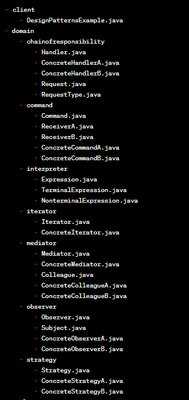

## Implementation

### Chain of Responsibility

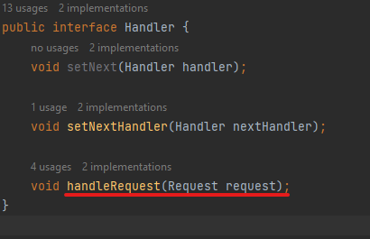

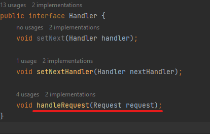

### Command 

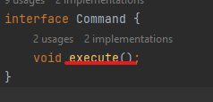

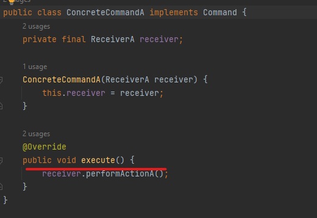

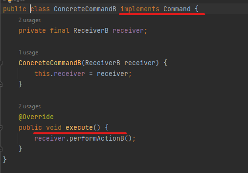

### Interpreter

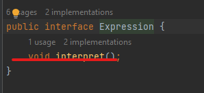

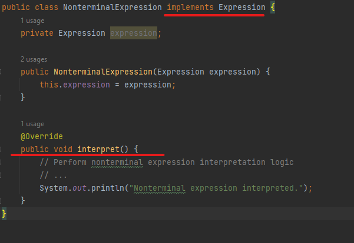

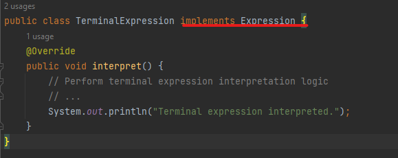

### Iterator

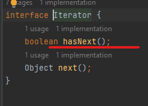

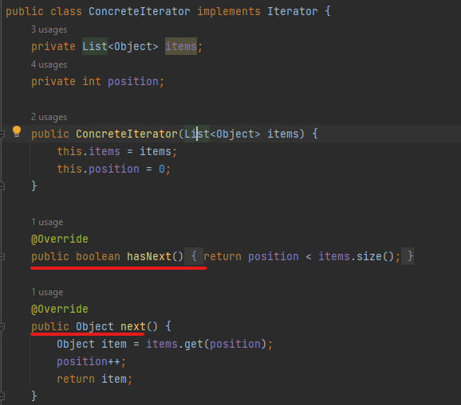

## Conclusion

In conclusion, the Java application demonstrates the implementation of several design patterns, including Chain of Responsibility, Command, Interpreter, and Iterator. Each design pattern addresses specific design challenges and promotes flexibility and maintainability in the codebase.

The Chain of Responsibility pattern allows a request to be passed through a series of handlers until it is handled by an appropriate handler, providing a dynamic and decoupled way of handling requests.

The Command pattern encapsulates requests as objects, allowing parameterization of clients with different commands. It promotes loose coupling between the sender and receiver of the request and enables extensibility and flexibility in handling different types of commands.

The Interpreter pattern defines a language or grammar and provides a way to interpret sentences or expressions in that language. It allows the creation of a hierarchy of expressions to represent complex rules and enables the interpretation of the input based on those rules.

The Iterator pattern provides a way to access the elements of an aggregate object sequentially without exposing its underlying representation. It decouples the iteration logic from the aggregate, allowing different traversal algorithms to be used without modifying the aggregate structure.

Overall, the application showcases how these design patterns can be applied to improve code structure, flexibility, and maintainability. By encapsulating functionality, promoting loose coupling, and providing reusable abstractions, the design patterns enhance the modularity and extensibility of the codebase. They also enable the application to adapt to changing requirements and facilitate easier maintenance and testing.

By understanding and utilizing these design patterns, developers can design robust and scalable applications that are easier to understand, modify, and evolve over time.